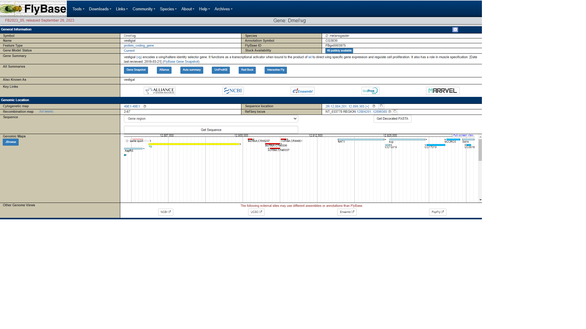
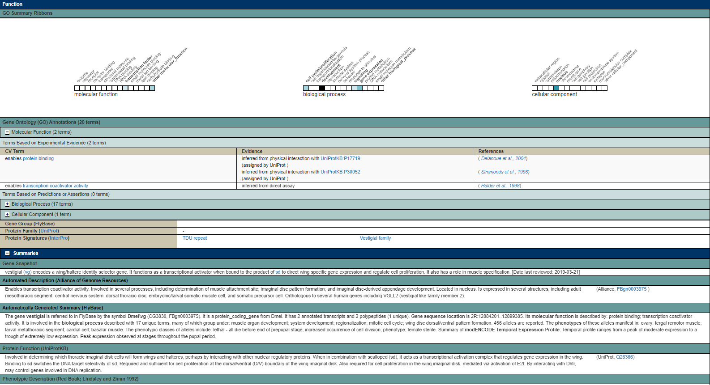
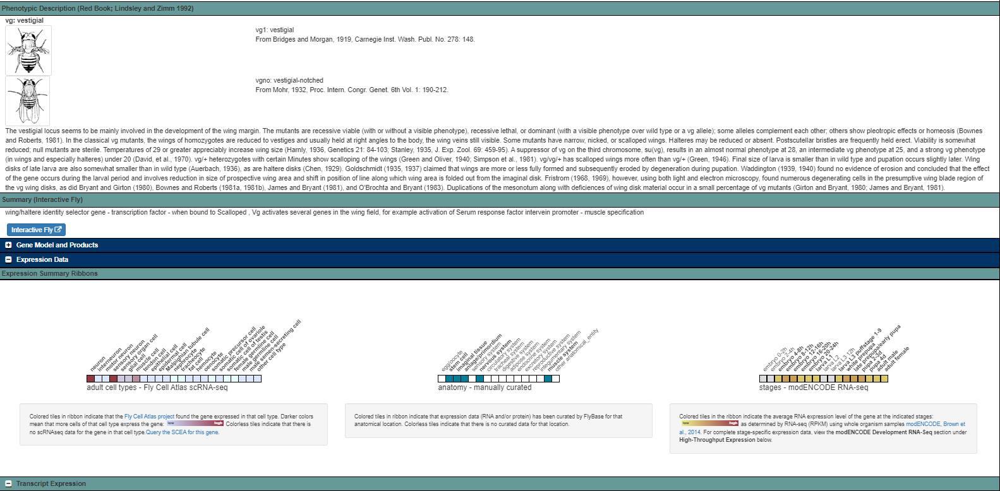

```{r setup, include=FALSE}
library(tidyverse)
library(kableExtra)
knitr::opts_chunk$set(echo = TRUE)
```

# 1. Outline

You will complete a series of computer and laboratory practical sessions in order to Plan, Record & Evaluate two sets of experiments that investigate gene function. 

You will be provided with a paper lab notebook that you must use to keep notes during the practical sessions, you will be required to transfer these notes to an Electronic Lab Notebook (ELN) where will also add analyses and files to enhance our notes.

During this module we will run two different experiments: 

1) Understanding the genetic basis of the Mismatch Repair (MMR) pathway in *E.coli*

2) Using CRISPR/Cas9 to study gene function in the fruitfly *Drosophila Melanogaster*

## Assessment

### Formative

- You will ask a lab partner to review your notebook every week, and in turn review theirs. You should provide feedback on the clarity, thoroughness and readability of their work

- You will review your lab notebook with the MO or one of the demonstrators at least once during the module

### Summative

At the end of term you will submit the ELN for **one** of the two experiments. This is worth 10% of your Module grade

## Learning Outcomes

- Link your theoretical knowledge of gene function to practical, experimental work.

- Gain experimental planning and interpretation skills required for Section B of your exam paper.

- Learn a number of molecular lab techniques.

- Learn a number of *in silico* computer-aided design and evaluation of molecular lab work techniques.

- Keep accurate, clear and reusable lab notes.

Students who adopt these basic but important research practices are more likely to gain some of the skills that are desperately needed by industrial and academic research centres.


# 2. Keeping a Laboratory Notebook

The following is general guidance on how to keep a paper-based laboratory (lab) notebook. Requirements in different disciplines (teaching, research, clinical labs) is likely to vary and many disciplines have their own community norms which must be observed. It is fine to adapt this guidance to fit your research. A well-kept lab notebook provides a reliable reference for writing up materials and methods and results for a study. It can be a legally valid record that preserves your rights or those of an employer or academic investigator to your discoveries. 

A good test of your work is the following question: could someone else, with an equivalent technical background to your own, use your notebook to repeat your work, and obtain the same results? For that matter, could you come back six months later, read your notes, and make sense of them? If you can answer yes to these two questions, you are keeping a good lab notebook.

## Benefits of a good lab notebook

- **Documenting Progress**: Lab notebooks provide a chronological record of your work, enabling you to track the evolution of your projects. This helps in identifying trends, troubleshooting issues, and making informed decisions for future experiments.

- **Data Integrity**: Accurate lab notebooks promote data integrity and transparency. They serve as evidence of your work's authenticity, which is essential for ethical research and collaboration.

- **Troubleshooting and Analysis**: In the event of unexpected outcomes or errors, a well-maintained lab notebook can be a lifeline. It allows you to retrace your steps, pinpoint sources of error, and refine your methods for better results.

- **Intellectual Property Protection**: For those working on innovative projects, lab notebooks can serve as crucial documentation for patents and intellectual property claims, safeguarding your ideas and innovations.

- **Communication**: Lab notebooks are valuable for communicating your findings to peers, professors, or future employers. They provide a comprehensive account of your work, making it easier for others to understand and build upon your research.

- **Enhanced Organizational Skills**: Maintaining an organized lab notebook cultivates discipline and organizational skills, which are transferable to other areas of academia and life.

- **Professional Development**: Learning to keep a lab notebook teaches undergraduates essential skills in record-keeping, critical thinking, and attention to detail, all of which are highly regarded in professional and academic settings.

In summary, accurate lab notebooks are more than just records; they are an essential tool for scientific and professional development. By cultivating this skill, undergraduate students not only enhance their academic experience but also prepare themselves for successful careers in research and beyond.

## Notebook choice

**Bound** - the bound notebook is the traditional lab notebook. The pages are numbered (or can be) and all bound together, which lowers the likelihood of losing pages. Since the numbered pages make it easy to see if any pages have been removed, the bound notebook is a legally strong notebook that is trusted to protect against allegations of fraud. However, it is difficult to make copies of bound notebooks and you must record the things that you do in the order that they are done, which makes organizing your notebook by experiment difficult.

**Electronic** electronic lab notebooks (ELNs) are gaining in popularity and are widely used in industrial research. They can be easy to use, provide good legibility and are easy to search. They also make it easy to link experimental information to digital data files. 

## Structure

**Date** – ideally you will use the ISO format for date eg 20200318 for 18th March 2020. If this is not used, it is useful to record the date in such a way that day and month are disambiguated eg 18Mar2020.

**Title** – each experiment should have a short title or experiment number which is unique to that experiment eg  Expt 1. Assess the phenotypes of wt, JW2799, JW4128, JW2702 E.coli strains

**Aim**  – a brief statement of the purpose of the experiment

**Procedures**  – this is where you record how you plan to do the experiment - protocols, reagents, materials, calculations and equipment. 

**Observations** – this is where you record what actually happened. This can include any deviations from the ‘How’ section (planned or unplanned) and raw experimental data (either actual data written or taped into the notebook, or a reference to the digital data file.

You should also record processing of raw data (or a reference to the processed file if it’s been done digitally) and record any interpretation you make of the data. Be sure to record details of any special software used in processing.

**Reflections** – this is where you might make notes on something you would do differently next time

**Next Time** - Many experiments are not completed in a single day (or even a week), so the information above may be split over several entries in your lab notebook. In this case, every entry relating to the experiment should have the date and title, and a cross-reference to the previous entry should also be recorded, eg 'continued from 27th September 2023, Book 3, page 23'

### Details 

The range of information which can be recorded in the ‘Details’ section is vast and depends on your research. 

The list below is intended to show some examples of information but is in no way exhaustive. A simple rule to follow when deciding to write down information in your notebook is this; it is better to write it down and not need it, than to need it and not have written it down.

- Reagents - source, product number

- Solutions 

- Samples - type, name, location

- Instruments - type, name, location

- Protocols - reference the protocol you are using

- Software or code - reference any specific software or code

- Calculations - record any calculations made


## Integrity

One of the purposes of keeping a good lab notebook is to protect you from allegations of fraud.

There are ethical standards you must follow to allow your notebook to act as a form of protection.

These are a few of the more important guidelines: 

**All data goes in the notebook** - it is important that all your data be recorded in your notebook. This includes data that are hard to interpret, contradictory to previous data, or just plain ugly. Even if your experiment fails completely, you need to record the negative data and/or describe what happened. 

**No pages get removed** - as a means of assuring the integrity of your notebook, no pages should ever be removed for any reason. In bound notebooks, it is important to not skip pages in your notebook and to cross out any unused parts of a page. This prevents you or someone else from going back and adding things after the fact. It is important that your notebook be accurate, but mistakes happen. 

**Don’t obliterate mistakes** - when keeping your notebook, remember to correct your mistakes, but never remove them. To correct a mistake, cross it out with a single line. If you pasted the wrong thing in your notebook, cross it out and paste in the correct item without covering up anything already in the notebook. Ideally, you should sign and date all corrections so that they can be authenticated. 


# 3. Lab Notebook Checklist

## Example layout

[Here is an example of this layout in action](https://github.com/Philip-Leftwich/5009A_Labs/blob/master/Example-notebook.pdf)

## Checklist

```{r Mark scheme, echo=FALSE}
knitr::kable(rbind(
                    c("[  ]","Title of experiment at the top of each section"),
                    c("[  ]","Date of experiment"),
                    c("[  ]","Objective/Aim of experiment given"),
                    c("[  ]","Relevant citations or reading are included"),
                    c("[  ]","Plan/outline is given"),
                    c("[  ]","Step-by-step procedures are present, or clear reference to established protocols"),
                    c("[  ]","Any deviations from established protocols are clearly detailed"),
                    c("[  ]","Instruments, conditions, parameters & reagents are provided^1"),
                    c("[  ]","Observations are recorded"),
                    c("[  ]", "Unanticipated observations or conditions"),
                    c("[  ]","Any samples generated are recorded as they are labelled"),
                    c("[  ]","Wherever possible data is identified and included in the notebook"),
                    c("[  ]","Where it is not possible to include data - names and file locations of data are included"),
                    c("[  ]","Conclusions and suggestions for future work or next steps are included"),
                    c("[  ]","Entries are written clearly and in full sentences"),
                    c("[  ]","It is clear where one experiment ends and another begins"),
                    c("[  ]","It is clear what is your work, class work or group work"),
                    c("[  ]","Entries are complete"),
                    c("[  ]","Names of people you worked with are included"),
                    c("[  ]","Entries are clear and easy to read - headers, subheaders and sections are used"),
                    c("[  ]","Electronic data is clearly organised using folders and subdirectories"),
                    c("[  ]","Physical lab notebooks are signed and dated"),
                    c("[  ]","Any abbreviations are defined"),
                    c("[  ]","Links to analyses or *in silico* designs are referenced in the notebook"),
                    c("[  ]","Any required analyses or predictions are included")
                    ),
             
              caption = ' ',
              col.names = c("Completed", "Description"),
                           booktabs=T ) %>% 
  kable_styling("striped", full_width=F) %>% 
  group_rows(index=c("Experimental Records" = 14, "General Housekeeping" = 9, "Analyses" = 2)) %>% 
  column_spec(2, bold=T) %>% 
  footnote(general = "Examples of reagents and conditions ",
           number = c("Centriguge settings, Incubator settings, Sizes and types of tubes, Buffers, Media, Concentrations, Volumes, Wash steps, PCR reagents, Primers")
           )
```

# 4. Computer Lab - Session 1

Today's objective is to start some background reading on the experimental background to "Understanding the genetic basis of the Mismatch Repair (MMR) pathway in *E.coli*" - you will then start a project on the ELN Benchling - and make your first entry - a brief introduction to the project and its experimental aims, finally we will add the pRB318 plasmid to the project, annotate the plasmid and include some details in our lab notebook. 

## 1. Background Reading

- Experimental Handbook

- Klug, Cummings, Spencer, Palladino, Killian. Concepts of Genetics Pearson.p392

- Hartwell, Hood, Goldberg, Reynolds, Silver, Veres. Genetics, from genes to genomes (3rd edition) McGraw Hill.pp 503-506

### Questions

  With the background reading available, try and get a feel for the experimental objectives - based on your understanding of MMR in 
*E.coli* - which of these bacterial strains are likely to have a high mutation rate? 
  
  How will we test this, what are we attempting to observe?
  
This is a simple simulation of the L-D assay and screening - when you play with it, what determines the observance of mutants? Time, mutational rate or both? https://philip-leftwich.shinyapps.io/Luria_Delbruck/


## 2. Getting to grips with Electronic Lab Notebooks

By the end of today's session we should have a project set up on Benchling, one plasmid file and one entry into a lab notebook - scroll through the below to get yourself set-up

### Why use Benchling?

- Used by [> 270,000+](https://www.benchling.com/customer-stories) scientists worldwide in biotech, pharma and academia - secure data records

- Is an Electronic Lab Notebook (ELN) with features for Biochemistry, Genetics and Molecular Biology

- Entries save *automatically* and are shareable and searchable 

- ELNs are a widely used professional tool

- Familiarity with the inbuilt molecular design tools is a *desirable employability skill*

### Sign up

Sign up for FREE here http://benchling.com/signup

  - Use your university e-mail
  - Works best in Chrome

[Here is a quick sign-up tutorial](https://www.loom.com/share/dc0b8fbc3b3344ceb8f6c77df87b6ffe?sid=b4bdd011-87f8-4a30-a432-e3a7dd9c9b5f)


```{r, echo=FALSE, out.width = "100%"}

```

### Basics of Benchling

[Learn how to get started and sign up with Benchling here.](https://help.benchling.com/hc/en-us/articles/9684234496013-The-Basics-of-Benchling)


## 3. Annotating a Plasmid

Before starting this annotation you should have: 

- A project title "Understanding the genetic basis of the Mismatch Repair (MMR) pathway in *E.coli* - BIO5009A"

- In this project one folder called "DNA Inventory"

- One Lab Notebook with the following clear entries

    1. Title
    2. A clear introduction to the experimental aims (100-150 words)
    3. Objectives - Clearly state the specific objectives or research questions that your experiment aims to address. What do you hope to achieve or discover through this experiment?
    4. Hypotheses (if applicable):
    
    
### Plasmid annotation

This worksheet teaches you how to use Benchling to view and understand sequence annotations. With sequence annotation, we can mark out important regions in DNA sequences, such as mutations, cut sites, coding regions, transcription factor binding sites or primer binding sites. Benchling generates a graphical map of your annotated sequences as you go, giving you an organized overview of the important parts of DNA in your sequence

Annotation is simple and just requires a foundation on the types of DNA features that you might wish to label on your sequences. In this module, you will learn what some general features are such as promoters, mutations, primer binding sites or coding regions

Copy the [pRB318 plasmid](https://github.com/Philip-Leftwich/5009A_Labs/blob/master/molecular%20data/prb318.gb) into your own Project on Benchling so you can edit as you please. Afterwards, navigate to your Vector sequence and you will see there are three different ways to view this sequence:

Sequence map

Linear map

Plasmid map

All three views have annotation features, only the sequence map shows the actual nucleotide sequence, the linear map shows the plasmid as though it is a linear sequence, while the plasmid map shows the plasmid in its native circular form.

https://www.loom.com/share/4f9d040c879642f7bd16558ffa89e247

There is no correct way to view this sequence, and you may find you have a particular preference, or that the method of viewing your sequence will be highly dependent on your experimental purpose.


| Annotation            | Description                           |
|---------------------|-----------------------------------------|
| E.coli mutS            | The full length mutS gene from E.coli |
| trc promoter | Strong promoter to drive gene of interest|
| mutS CDS           | The section of the gene which is translated into protein (coding domain sequence) - begins at start and ends at stop codon |
| AmpR CDS            | The coding domain sequence for the Ampicillin Resistance Gene - used as the selection marker for transformation |
| E.coli mutS            | The full length mutS gene from E.coli |ColE1 Origin | Origin of replication -  Plasmids carrying this origin exist in high copy numbers in E. coli.|
|rrnB terminator | Signal sequence to terminate the transcript made from the gene of interest, preventing run-on transcription.|
|lacI | Represses transcription of gene of interest in the presnence of lactose|

You can scroll through the map, or if you click on the “Annotations” button you will find a list of all the annotated features, their Location, Length of feature and the color of the annotation. Here you can toggle visibility of each feature on/off or edit each annotation manually.

**Question** - What are the "Locations" (range in the sequence) and Lengths (number of base pairs) for the following?

- AmpR CDS

- rrnB Terminator

- mutS CDS

**Task** 
The AmpR promoter is supposed to be annotated at bp 3356-3447. Can you add it?

### Translation of mutS

Toggle on/off different viewing features through the ⚙️ icon like “ORFs” or “Amino Acid Indices” which make it easier to find relevant information.

Click on the mutS CDS starting point at the beginning of the mutS gene to highlight the related sequence information.

Hover over the DNA sequence and right click to bring up a menu and select “Create Translation”.

Observe that this now creates a translation reading frame on top of the DNA sequence.

https://www.loom.com/share/1569540790764f1aa1eafd0d12387399?sid=57a5fe71-26be-4977-9f6d-b8094c6a40c3


### Finished

When you have finished these activities - drag and drop the pRB318 plasmid into your notebook and write a brief summary of what you did. 

# 5. Computer Lab Session 2

In today's session we will work to develop and improve our lab notes and make some computational analyses.

## 1. Lab notes

Review your lab notes made during your in-class practical sessions using the guides on keeping a laboratory notebook and the lab notebook checklist. 

Transfer your paper notes to your electronic lab notebook, as you do so using the guides and checklists to guide the structure and clarity of your writing. 

- What detail is missing from your lab notes that you realise you should have written down at the time

- What parts of your notes are less than perfectly clear and can you improve this now?

- Check your structure and content with your friends, ask your lecturer or demonstrator for feedback

## 2. Add protocols to your entries

You have been provided with links to examples of protocols on Benchling, you also have access to your lab protocols in your handbook. 

- Attach [Protocol Entries](https://help.benchling.com/hc/en-us/articles/9684268242957-Create-and-attach-protocols-to-entries) using this guide retrieve the protocol pdfs from Blackboard and attach them as entries to your lab notes in the appropriate sections.

## Designing primers

In our practical sessions we carried out a bacterial transformation to introduce the pRB318 plasmid into our cells. Using an Ampicillin selection plate we should be able to recover colonies that are Ampicillin resistant thanks to the AmpR gene on the plasmid. In order to confirm successful transformation we will carry out a [colony PCR](https://pubmed.ncbi.nlm.nih.gov/24011056/#:~:text=Colony%20PCR%20is%20a%20method,a%20portion%20of%20the%20construct.) to confirm the presence of plasmid DNA in our cells. 

In this pRB318 template, you will see that there are two pre-designed primers attached to the template sequence (AmpR and AmpF). Find these annotations and note the following properties for each:

- Length

- GC content

- Melting temperature

Some guidelines for designing PCR primers include:

- Length of 18-24 bases (Specificity usually is dependent on the length and annealing temperature. The shorter the primers are, the more efficiently they will bind or anneal to the target.)

- 40-60% G/C content (Be mindful not to have too many repeating G or C bases, as this can promote primer-dimer formation.)

- Start and end with 1-2 G/C pairs (This is known as a GC Clamp).

- Melting temperature (Tm) of 50-60°C (This can depend on your PCR buffer conditions and DNA polymerase as well).

- Primer pairs should have a Tm within 5°C of each other

- Primer pairs should not have complementary regions

Question(s)

How many of these guidelines does the AmpR primer pair meet?

What is the expected size (in bp) of the PCR amplicon that would be generated when using these primers?


Make sure this information is in your lab notebook. 


# 4. Computer Lab - Session 3

## Functional analysis of an E. coli DNA repair protein

### 1. Lab notes

Review your lab notes made during your in-class practical sessions using the guides on keeping a laboratory notebook and the lab notebook checklist. 

Transfer your paper notes to your electronic lab notebook, as you do so using the guides and checklists to guide the structure and clarity of your writing. 

- What detail is missing from your lab notes that you realise you should have written down at the time

- What parts of your notes are less than perfectly clear and can you improve this now?

- Check your structure and content with your friends, ask your lecturer or demonstrator for feedback

### Data

1.Add your colony PCR gel images to your notebook. Make sure the gel photo is clearly labelled/titled and sits in a clear structure with your notes

Include an interpretation, have you got confirmation that your colony PCR worked? Did most of the PCRs work? 

  - the presence of a band at the correct size picked from an LB-Amp plate is good confirmation that your transformation has worked. 
    
  - the lack of a band is not proof your transformation didn't work, it could be your PCR didn't work. Remember you still had a colony on your LB-Amp plate, which shouldn't be possible without the AmpR gene on pRB318.
    
2. Add the whole class data from the **two** LD-assay experiments (with and without pRB318). 

- Include a simple figure that illustrates these results

- Include a clear written summary of what this data *shows*

- These are your **most important** results. Do these results match your predictions? What do these results tell us about the *Functional analysis of an E. coli DNA repair protein - mutS*

## *Drosophila* Cas9 Reverse Genetics experiments

This is a **new** experiment, so the information going in here should be in **at least** a new notebook, or possibly a new project. 

In this notebook, you should write up what you did in your lab sessions, a brief introduction to reverse genetics, and our aim of seeing if we can recreate classical mutants by CRISPR/Cas9 gene knockout. 

I expect to see a well structured lab book - just like we have been practising. 


### Flybase

[FlyBase](https://flybase.org/reports/FBgn0003975)  is the database used daily by anyone that works on Drosophila. It contains all the information there is to know about the Drosophila melanogaster genome (and others), including gene annotations, expression data, phenotypic data and any stocks publicly available.

The wealth of information available is the main obstacle to be overcome by anyone new to large databases such as FlyBase. There are many in-depth guides on how to use FlyBase, but often only a small snippet of information is what you’re after when you look up a gene.

The best way to understand FlyBase is to use it. The purpose of this guide is to help anyone new to it get into it for the first time and basic information about a gene.

This section will highlight a few of the most immediately useful pieces of information displayed on a typical gene page:

#### General Information

This section contains the identity of the gene. The Name of the gene is given along with its Symbol (f), which can be used as an abbreviation. The unique CG (Computed Gene) number and FB ID are also given, but are often not stated in publications for named genes. Genes without a name are referred to by their CG number. The Gene Model Status tells you whether the gene is known to or thought to exist (current). Genes found not to exist can still be looked up for reference.

```{r, echo=FALSE, out.width = "100%"}

```

#### Genomic Location

This section tells you exactly where the gene is in the genome. The important bits are the Chromosome (and arm if the gene is on an autosome), the Sequence Location and the orientation of the gene (shown by a [+] or [–]). The Genomic Maps section gives a visual representation of the area surrounding the gene, showing other nearby genes and their orientations. The buttons Get genome region and Get FastA allow you to download the entire gene sequence, or just the parts you’re interested in (e.g. exons only). The four most useful are: Gene region – the whole sequence as it is in the genome, Transcripts – the mature mRNA sequence(s) produced from the gene, the CDS (coding sequence) – the sections of the mRNA transcript(s) that are actually translated into protein, and the Translations – the protein(s) produced from the gene.


#### Summary Information

This is the section to look at if you want a quick overview of what a gene does. The molecular function, biological processes and phenotypes annotations tell you what is known, or predicted, about the gene’s function. For a more detailed description of phenotypes, the Phenotypic Descriptions of Classical Alleles button will take you to a page containing information about different alleles, with links to the publications in which they were originally described.

```{r, echo=FALSE, out.width = "100%"}

```

#### Phenotypic descriptions

This is the section to look at, if there are any descriptions of any mutants previously characterised

```{r, echo=FALSE, out.width = "100%"}

```

#### Expression data

This is the section with any mRNA expression data, the three main charts are split into: tissue types, anatomical locations and developmental times.

#### BLAST 

In bioinformatics, BLAST (basic local alignment search tool)[2] is an algorithm and program for comparing primary biological sequence information, such as the amino-acid sequences of proteins or the nucleotides of DNA and/or RNA sequences. A BLAST search enables a researcher to compare a subject protein or nucleotide sequence (called a query) with a library or database of sequences, and identify database sequences that resemble the query sequence above a certain threshold.

We can use BLAST to compare the designed sgRNAs in our transgenic sgRNA flies and check where they are designed to cut in the target gene. 

```{r, echo=FALSE, out.width = "100%"}
knitr::include_graphics("img/BLAST.png")
```


### Tasks

Use the links provided to the Vienna Biocenter for each line:

| Lines   | Key   | Genotype                       | Link                                         |
|---------|-------|--------------------------------|----------------------------------------------|
| 340009  | S2    | nub-Gal4-UAS-Cas9              | [Link](https://shop.vbc.ac.at/vdrc_store/340009.html) |
| 340017  | S3    | Act5C-Gal4-UAS-Cas9            | [Link](https://shop.vbc.ac.at/vdrc_store/340017.html) |
| 341789  | S4    | sgRNA: TCATGTTGAACAGCGAGAGC; sgRNA: TGCTAATGCTGTGCTGGTCG | [Link](https://shop.vbc.ac.at/vdrc_store/341789.html) |
| 342814  | S5    | sgRNA: GGCGGCCCACAATAGTGCAG; sgRNA: ATCGTTCTACCAGTATGAGA | [Link](https://shop.vbc.ac.at/vdrc_store/342814.html) |


Here you can find a link to the gene profile for each one in FlyBase. 

In turn: 

1. What are the tissue and timing expressions for the two Cas9 lines? A brief one or two line summary

2. What are the two genes being targeted? What information do we have about the function of these genes, and what do naturally occurring mutants of these lines look like?

3. Using BLAST can you check that the sgRNAs target the correct gene? 
> Note you don't have to do this for all of them. I just want you to have a go at using BLAST

4. Add the two target genes to Benchling.

[*vestigial*](https://github.com/Philip-Leftwich/5009A_Labs/blob/master/molecular%20data/vg.gb)

[*dpp*](https://github.com/Philip-Leftwich/5009A_Labs/blob/master/molecular%20data/dpp.gb)

Download the two target genes into your own Project on Benchling and add the two sgRNAs (for each gene) as annotations. 


# 4. Computer Lab - Session 4

## Functional analysis of an E. coli DNA repair protein

### Tasks

Download a copy of the *rpoB* gene by using the import from database function. Use the *E.coli* GCA_000798515 genome.

Create an alignment with our sequencing files and note where mutations appear to have occurred

##  *Drosophila* Cas9 Reverse Genetics experiments

### Tasks 

Write up the phenotypic data from these crosses

Design a molecular strategy that would allow you to confirm that observed mutants are the result of CRISPR deletions and that wildtypes are the absence of CRISPR editing. In the course of this you should - design appropriate primers using Benchling primer tools, make a note of the expected differences in amplicon sizes, write or adapt existing protocols for use of reagents, and conditions.

