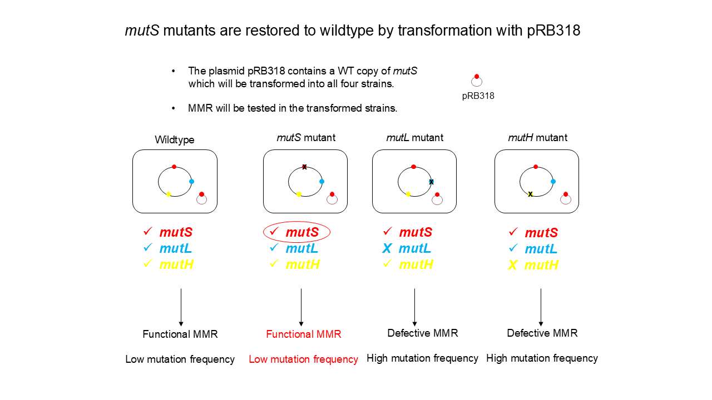

```{r setup, include=FALSE}
library(tidyverse)
library(kableExtra)
knitr::opts_chunk$set(echo = TRUE)
```

# 1. Outline

You will complete a series of computer and laboratory practical sessions in order to Plan, Record & Evaluate two sets of experiments that investigate gene function. 

You will be provided with a paper lab notebook that you must use to keep notes during the practical sessions, you should transfer these notes to an Electronic Lab Notebook (ELN) where will also add analyses and files to enhance our notes.

> Take photos of your paper lab notes and upload these to Benchling to save typing up notes by hand

During this module we will run a series of different experiments: 

1) Understanding the genetic basis of the Mismatch Repair (MMR) pathway in *E.coli* by functional knockout with CRISPR/Cas9

2) Confirmation of the function of *mutS* by restoration of loss of function with a *mutS* transgene

3) Sequencing of the *rpoB* gene to understand the mutations that provide antibiotic resistance


## Assessment

### Formative


- You will review your lab notebook with the MO or one of the demonstrators each session

### Summative

At the end of term you will submit the lab notebook for your experiments

## Learning Outcomes

- Link your theoretical knowledge of gene function to practical, experimental work.

- Gain experimental planning and interpretation skills required for Section B of your exam paper.

- Learn a number of molecular lab techniques.

- Learn a number of *in silico* computer-aided design and evaluation of molecular lab work techniques.

- Keep accurate, clear and reusable lab notes.

Students who adopt these basic but important research practices are more likely to gain some of the skills that are desperately needed by industrial and academic research centres.


# 2. Keeping a Laboratory Notebook

The following is general guidance on how to keep a paper-based laboratory (lab) notebook. Requirements in different disciplines (teaching, research, clinical labs) is likely to vary and many disciplines have their own community norms which must be observed. It is fine to adapt this guidance to fit your research. A well-kept lab notebook provides a reliable reference for writing up materials and methods and results for a study. It can be a legally valid record that preserves your rights or those of an employer or academic investigator to your discoveries. 

A good test of your work is the following question: could someone else, with an equivalent technical background to your own, use your notebook to repeat your work, and obtain the same results? For that matter, could you come back six months later, read your notes, and make sense of them? If you can answer yes to these two questions, you are keeping a good lab notebook.

## Benefits of a good lab notebook

- **Documenting Progress**: Lab notebooks provide a chronological record of your work, enabling you to track the evolution of your projects. This helps in identifying trends, troubleshooting issues, and making informed decisions for future experiments.

- **Data Integrity**: Accurate lab notebooks promote data integrity and transparency. They serve as evidence of your work's authenticity, which is essential for ethical research and collaboration.

- **Troubleshooting and Analysis**: In the event of unexpected outcomes or errors, a well-maintained lab notebook can be a lifeline. It allows you to retrace your steps, pinpoint sources of error, and refine your methods for better results.

- **Intellectual Property Protection**: For those working on innovative projects, lab notebooks can serve as crucial documentation for patents and intellectual property claims, safeguarding your ideas and innovations.

- **Communication**: Lab notebooks are valuable for communicating your findings to peers, professors, or future employers. They provide a comprehensive account of your work, making it easier for others to understand and build upon your research.

- **Enhanced Organizational Skills**: Maintaining an organized lab notebook cultivates discipline and organizational skills, which are transferable to other areas of academia and life.

- **Professional Development**: Learning to keep a lab notebook teaches undergraduates essential skills in record-keeping, critical thinking, and attention to detail, all of which are highly regarded in professional and academic settings.

In summary, accurate lab notebooks are more than just records; they are an essential tool for scientific and professional development. By cultivating this skill, undergraduate students not only enhance their academic experience but also prepare themselves for successful careers in research and beyond.

## Notebook choice

**Bound** - the bound notebook is the traditional lab notebook. The pages are numbered (or can be) and all bound together, which lowers the likelihood of losing pages. Since the numbered pages make it easy to see if any pages have been removed, the bound notebook is a legally strong notebook that is trusted to protect against allegations of fraud. However, it is difficult to make copies of bound notebooks and you must record the things that you do in the order that they are done, which makes organizing your notebook by experiment difficult.

**Electronic** electronic lab notebooks (ELNs) are gaining in popularity and are widely used in industrial research. They can be easy to use, provide good legibility and are easy to search. They also make it easy to link experimental information to digital data files. 

## Structure

**Date** – ideally you will use the ISO format for date eg 20200318 for 18th March 2020. If this is not used, it is useful to record the date in such a way that day and month are disambiguated eg 18Mar2020.

**Title** – each experiment should have a short title or experiment number which is unique to that experiment eg  Expt 1. Assess the phenotypes of wt, JW2799, JW4128, JW2702 E.coli strains

**Aim**  – a brief statement of the purpose of the experiment

**Procedures**  – this is where you record how you plan to do the experiment - protocols, reagents, materials, calculations and equipment. 

**Observations** – this is where you record what actually happened. This can include any deviations from the ‘How’ section (planned or unplanned) and raw experimental data (either actual data written or taped into the notebook, or a reference to the digital data file.

You should also record processing of raw data (or a reference to the processed file if it’s been done digitally) and record any interpretation you make of the data. Be sure to record details of any special software used in processing.

**Reflections** – this is where you might make notes on something you would do differently next time

**Next Time** - Many experiments are not completed in a single day (or even a week), so the information above may be split over several entries in your lab notebook. In this case, every entry relating to the experiment should have the date and title, and a cross-reference to the previous entry should also be recorded, eg 'continued from 27th September 2023, Book 3, page 23'

### Details 

The range of information which can be recorded in the ‘Details’ section is vast and depends on your research. 

The list below is intended to show some examples of information but is in no way exhaustive. A simple rule to follow when deciding to write down information in your notebook is this; it is better to write it down and not need it, than to need it and not have written it down.

- Reagents - source, product number

- Solutions 

- Samples - type, name, location

- Instruments - type, name, location

- Protocols - reference the protocol you are using

- Software or code - reference any specific software or code

- Calculations - record any calculations made


## Integrity

One of the purposes of keeping a good lab notebook is to protect you from allegations of fraud.

There are ethical standards you must follow to allow your notebook to act as a form of protection.

These are a few of the more important guidelines: 

**All data goes in the notebook** - it is important that all your data be recorded in your notebook. This includes data that are hard to interpret, contradictory to previous data, or just plain ugly. Even if your experiment fails completely, you need to record the negative data and/or describe what happened. 

**No pages get removed** - as a means of assuring the integrity of your notebook, no pages should ever be removed for any reason. In bound notebooks, it is important to not skip pages in your notebook and to cross out any unused parts of a page. This prevents you or someone else from going back and adding things after the fact. It is important that your notebook be accurate, but mistakes happen. 

**Don’t obliterate mistakes** - when keeping your notebook, remember to correct your mistakes, but never remove them. To correct a mistake, cross it out with a single line. If you pasted the wrong thing in your notebook, cross it out and paste in the correct item without covering up anything already in the notebook. Ideally, you should sign and date all corrections so that they can be authenticated. 


# 3. Lab Notebook Checklist

## Example layout

[Here is an example of this layout in action](https://github.com/Philip-Leftwich/5009A_Labs/blob/master/Example-notebook.pdf)

## Checklist

```{r Mark scheme, echo=FALSE}
knitr::kable(rbind(
                    c("[  ]","Title of experiment at the top of each section"),
                    c("[  ]","Date of experiment"),
                    c("[  ]","Objective/Aim of experiment given"),
                    c("[  ]","Relevant citations or reading are included"),
                    c("[  ]","Plan/outline is given"),
                    c("[  ]","Step-by-step procedures are present, or clear reference to established protocols"),
                    c("[  ]","Any deviations from established protocols are clearly detailed"),
                    c("[  ]","Instruments, conditions, parameters & reagents are provided^1"),
                    c("[  ]","Observations are recorded"),
                    c("[  ]", "Unanticipated observations or conditions"),
                    c("[  ]","Any samples generated are recorded as they are labelled"),
                    c("[  ]","Wherever possible data is identified and included in the notebook"),
                    c("[  ]","Where it is not possible to include data - names and file locations of data are included"),
                    c("[  ]","Conclusions and suggestions for future work or next steps are included"),
                    c("[  ]","Entries are written clearly and in full sentences"),
                    c("[  ]","It is clear where one experiment ends and another begins"),
                    c("[  ]","It is clear what is your work, class work or group work"),
                    c("[  ]","Entries are complete"),
                    c("[  ]","Names of people you worked with are included"),
                    c("[  ]","Entries are clear and easy to read - headers, subheaders and sections are used"),
                    c("[  ]","Electronic data is clearly organised using folders and subdirectories"),
                    c("[  ]","Physical lab notebooks are signed and dated"),
                    c("[  ]","Any abbreviations are defined"),
                    c("[  ]","Links to analyses or *in silico* designs are referenced in the notebook"),
                    c("[  ]","Any required analyses or predictions are included")
                    ),
             
              caption = ' ',
              col.names = c("Completed", "Description"),
                           booktabs=T ) %>% 
  kable_styling("striped", full_width=F) %>% 
  group_rows(index=c("Experimental Records" = 14, "General Housekeeping" = 9, "Analyses" = 2)) %>% 
  column_spec(2, bold=T) %>% 
  footnote(general = "Examples of reagents and conditions ",
           number = c("Centriguge settings, Incubator settings, Sizes and types of tubes, Buffers, Media, Concentrations, Volumes, Wash steps, PCR reagents, Primers")
           )
```

# 4. Computer Lab - Session 1

**The best and easiest way to work is to make a lab notebook for this project - but simply take photos and upload your written entries as pictures. For today's computer work make a new "entry" and write a summary of what you did today - in the same way as you keep your paper lab notes.**


Today's objective is to carry out some molecular analyses to support your lab experiments on:  "Understanding the genetic basis of the Mismatch Repair (MMR) pathway in *E.coli*" - you will start a project on the ELN Benchling - and make your first entry - a brief introduction to the project and its experimental aims, finally we will add the Cas9 plasmid to the project, identify the gRNA being used and score its on-target and off-target efficiencies


## 1. Background Reading

- Experimental Handbook

- Klug, Cummings, Spencer, Palladino, Killian. Concepts of Genetics Pearson.p392

- Hartwell, Hood, Goldberg, Reynolds, Silver, Veres. Genetics, from genes to genomes (3rd edition) McGraw Hill.pp 503-506


## 2. Getting to grips with Electronic Lab Notebooks

By the end of today's session we should have a project set up on Benchling, one plasmid file and one entry into a lab notebook - scroll through the below to get yourself set-up

### Why use Benchling?

- Used by [> 270,000+](https://www.benchling.com/customer-stories) scientists worldwide in biotech, pharma and academia - secure data records

- Is an Electronic Lab Notebook (ELN) with features for Biochemistry, Genetics and Molecular Biology

- Entries save *automatically* and are shareable and searchable 

- ELNs are a widely used professional tool

- Familiarity with the inbuilt molecular design tools is a *desirable employability skill*

### Sign up

Sign up for FREE here http://benchling.com/signup

  - Use your university e-mail
  - Works best in Chrome

[Here is a quick sign-up tutorial](https://www.loom.com/share/dc0b8fbc3b3344ceb8f6c77df87b6ffe?sid=b4bdd011-87f8-4a30-a432-e3a7dd9c9b5f)


```{r, echo=FALSE, out.width = "100%"}

```

### Basics of Benchling

[Learn how to get started and sign up with Benchling here.](https://help.benchling.com/hc/en-us/articles/9684234496013-The-Basics-of-Benchling)


## 3. Documenting a CRISPR Plasmid

Before starting this annotation you should have: 

- A project title "Understanding the genetic basis of the Mismatch Repair (MMR) pathway in *E.coli* - BIO5009A"

- In this project one folder called "DNA Inventory"

- One Lab Notebook clear entries transcribing your notes from your paper lab notebook

    1. Title
    2. A clear introduction to the experimental aims (100-150 words)
    3. Objectives - Clearly state the specific objectives or research questions that your experiment aims to address. What do you hope to achieve or discover through this experiment?
    4. Hypotheses (if applicable):
    
CRISPR which stands for “Clustered Regularly Interspaced Short Palindromic Repeats” is a family of DNA sequences that are found in prokaryotic organisms such as archaea and bacteria and have been linked to innate immunity in these systems against predators such as bacteriophages. CRISPR sequences function in conjunction with Cas proteins (the most notable member being Cas9) to protect the organism by recognizing and destroying DNA from the invading phage. CRISPR-Cas9 has been repurposed and engineered by scientists from its native context to be a robust and effective method for gene-editing.
    
### Uploading a plasmid  

Copy the [Cas9 plasmid](https://github.com/Philip-Leftwich/5009A_Labs/blob/master/molecular%20data/cas9-plasmid.gb) into your own Project on Benchling so you can edit as you please.

- Download the file (it is in genbank .gb format)

- Go to the folder you have made called "DNA Inventory" on Benchling

- Once inside this folder on the menu go to `+` and select Import DNA/RNA sequence

- Drag and Drop or select upload file and add your cas9-plasmid.gb file

 Afterwards, navigate to your Vector sequence and you will see there are three different ways to view this sequence:

Sequence map

Linear map

Plasmid map

All three views have annotation features, only the sequence map shows the actual nucleotide sequence, the linear map shows the plasmid as though it is a linear sequence, while the plasmid map shows the plasmid in its native circular form.

https://www.loom.com/share/4f9d040c879642f7bd16558ffa89e247

There is no correct way to view this sequence, and you may find you have a particular preference, or that the method of viewing your sequence will be highly dependent on your experimental purpose.

You can drag and drop your plasmid file from the menu bar into an open lab notebook - this lets you create links between molecular items and your notes. Try this now in the space where you first reference the plasmid in your notes. 

### Identifying the gRNA sequence

There are two parts to gRNA sequences

- The target sequence, programmed to match a target gene
- The scaffold, unchanging, binds to the Cas9 nuclease

We need to identify the target sequence and confirm it has a match in the *E.coli* *mutS* gene.

Find the annotation for `gRNA target sequence` and note this sequence. 

### Check gRNA targets against *mutS*

Copy the [mutS DNA sequence](https://github.com/Philip-Leftwich/5009A_Labs/blob/master/molecular%20data/mutS.gb) into your own Project on Benchling so you can edit as you please.

Click on the "CRISPR" icon on the right sidebar, and click on the Design and Analyze Guides button.

https://www.loom.com/share/f90cf28a546a4abdbc7f860104dc3888?sid=73291b39-da71-43f4-9fa1-1df9ab60c58c

A window titled, "Design CRISPR Guides: Guide Parameters" should be open and ensure that the following fields have the correct information below and then click Finish.

A new tab, Design CRISPR will appear and ask to specify the target region of mutS that you want to create guide RNAs for. Click on “Split Workspace” to visualize the guide RNAs and what parts of the mutS gene they target.
Go to your Sequence Map and highlight the entire sequence for mutS

Now click "Create" and guide RNA sequences will be generated and scored.

You can organize guide RNAs by clicking on the headers such as: "Position", "On-Target Score", and "Off-Target Score".

Sort these by "On-Target Score" and click on the checkbox for each guide RNA to visualize them in the DNA sequence.

- Now find our gRNA in this list and note the On-target and Off-target score in your notebook.

> Our sequence in the plasmd is in reverse-complement don't let this confuse you! 


## .4 Designing colony pcr primers

In our practical sessions we carried out a bacterial transformation to introduce the Cas9 plasmid into our cells. Using an Ampicillin selection plate we should be able to recover colonies that are Ampicillin resistant thanks to the AmpR gene on the plasmid. In order to confirm successful transformation we will carry out a [colony PCR](https://pubmed.ncbi.nlm.nih.gov/24011056/#:~:text=Colony%20PCR%20is%20a%20method,a%20portion%20of%20the%20construct.) to confirm the presence of plasmid DNA in our cells. 

Our two primers were as follows:

- AmpF: gcggccaacttacttctgac
- AmpR: caacgttgttgccattgct

Add these as oligos/primers to your DNA inventory

Note the following details about each: 
- Length

- GC content

- Melting temperature

Some guidelines for designing PCR primers include:

- Length of 18-24 bases (Specificity usually is dependent on the length and annealing temperature. The shorter the primers are, the more efficiently they will bind or anneal to the target.)

- 40-60% G/C content (Be mindful not to have too many repeating G or C bases, as this can promote primer-dimer formation.)

- Start and end with 1-2 G/C pairs (This is known as a GC Clamp).

- Melting temperature (Tm) of 50-60°C (This can depend on your PCR buffer conditions and DNA polymerase as well).

- Primer pairs should have a Tm within 5°C of each other

- Primer pairs should not have complementary regions

Question(s)

How many of these guidelines does the AmpR primer pair meet?

What is the expected size (in bp) of the PCR amplicon that would be generated when using these primers?

# 5. Computer Lab 2

## Hypothesis

```{r, echo = FALSE}

```
## 1. Annotating the pRB318 plasmid

This worksheet teaches you how to use Benchling to view and understand sequence annotations. With sequence annotation, we can mark out important regions in DNA sequences, such as mutations, cut sites, coding regions, transcription factor binding sites or primer binding sites. Benchling generates a graphical map of your annotated sequences as you go, giving you an organized overview of the important parts of DNA in your sequence

Annotation is simple and just requires a foundation on the types of DNA features that you might wish to label on your sequences. In this module, you will learn what some general features are such as promoters, mutations, primer binding sites or coding regions

Copy the [pRB318 plasmid](https://github.com/Philip-Leftwich/5009A_Labs/blob/master/molecular%20data/prb318.gb) into your own Project on Benchling so you can edit as you please. Afterwards, navigate to your Vector sequence and you will see there are three different ways to view this sequence:

- Sequence map

- Linear map

- Plasmid map

All three views have annotation features, only the sequence map shows the actual nucleotide sequence, the linear map shows the plasmid as though it is a linear sequence, while the plasmid map shows the plasmid in its native circular form.

https://www.loom.com/share/4f9d040c879642f7bd16558ffa89e247

There is no correct way to view this sequence, and you may find you have a particular preference, or that the method of viewing your sequence will be highly dependent on your experimental purpose.


| Annotation            | Description                           |
|---------------------|-----------------------------------------|
| E.coli mutS            | The full length *mutS* gene from E.coli |
| trc promoter | Strong promoter to drive gene of interest|
| mutS CDS           | The section of the gene which is translated into protein (coding domain sequence) - begins at start and ends at stop codon |
| AmpR CDS            | The coding domain sequence for the Ampicillin Resistance Gene - used as the selection marker for transformation |
ColE1 Origin | Origin of replication -  Plasmids carrying this origin exist in high copy numbers in E. coli.|
|rrnB terminator | Signal sequence to terminate the transcript made from the gene of interest, preventing run-on transcription.|
|lacI | Represses transcription of gene of interest in the presnence of lactose|

You can scroll through the map, or if you click on the “Annotations” button you will find a list of all the annotated features, their Location, Length of feature and the color of the annotation. Here you can toggle visibility of each feature on/off or edit each annotation manually.

**Question** - What are the "Locations" (range in the sequence) and Lengths (number of base pairs) for the following?

- AmpR CDS

- rrnB Terminator

- mutS CDS

**Task** 
The AmpR promoter is supposed to be annotated at bp 3356-3447. Can you add it?

### Translation of mutS

Toggle on/off different viewing features through the ⚙️ icon like “ORFs” or “Amino Acid Indices” which make it easier to find relevant information.

Click on the mutS CDS starting point at the beginning of the mutS gene to highlight the related sequence information.

Hover over the DNA sequence and right click to bring up a menu and select “Create Translation”.

Observe that this now creates a translation reading frame on top of the DNA sequence.

https://www.loom.com/share/1569540790764f1aa1eafd0d12387399?sid=57a5fe71-26be-4977-9f6d-b8094c6a40c3

## 2. Analysing Colony Count Data

Visualize and analyze colony forming unit (CFU) data, thinking critically about data distributions and statistical choices.

### Step 1: Explore the Data

#### Stop and Think:

- Look at the CFU counts for each condition.

- Questions to consider:

    Are the values all similar, or do some stand out?

    Do you notice any extreme values or patterns?


- Calculate simple summaries (median, range).


### Step 2: Visualize the Data

#### Stop and Think:

- Which type of graph might reveal differences between conditions?

- Would plotting raw CFU counts show patterns clearly?

- If the counts vary a lot, how could you adjust the scale to make differences more visible?

- Options to explore:

    Scatter plot, boxplot, bar chart, violin plot, etc.

    Linear scale vs. log scale.

    Overlay individual data points on summary plots.
    
- Do this in Excel, R, SPSS or whichever software you choose

### Step 3: Consider Data Transformation

#### Stop and Think:

- Does your data distribution suggest that a transformation might help?

- Which transformations could make differences easier to detect?

- How might a log transformation affect how you interpret the results?

- Options to explore:

      Log transformation

      Rank transformation

      No transformation

### Step 4: Choose an Analysis

#### Stop and Think:

- Are the assumptions of standard tests (like t-tests or ANOVA) met?

- What features of the data might suggest a non-parametric or rank-based test?

- How will your choice of graph affect how you communicate your analysis?

- Options to explore:

    Parametric test (t-test, ANOVA)

    Non-parametric test (Mann-Whitney, Kruskal-Wallis)

    Comparing medians or ranks instead of means

### Step 5: Put your Analysis and Figure into your ELN


# 6. Computer Lab 3.


## Functional analysis of an E. coli DNA repair protein *rpoB*

### Part 1

Annotate the rifampicin Resistance (rifR) Binding Domains in E. coli *rpoB*
Find the Specific Domains in Campbell et al. 2021:

- Open the paper by Campbell et al. (2021) and locate the sections describing the three rifampicin resistance-associated regions in the *rpoB* gene.

Identify the amino acid positions associated with each rifR binding domain. These positions represent parts of the RNA polymerase’s β-subunit that interact with rifampicin.

Why we’re doing this: These domains are where mutations can confer rifampicin resistance. Understanding their exact locations allows us to analyze how these regions are conserved across species.

- Import the *rpoB* gene by using the import from database function. Use the *E.coli* GCA_000798515 genome.

- Annotate the 3 rifR Domains:

- Select the amino acid positions for each rifR domain based on the information from Campbell et al. (2021).

Use Benchling’s annotation tool to mark each domain separately, labeling them “rifR Domain 1,” “rifR Domain 2,” and “rifR Domain 3.”

Why we’re doing this: By annotating these domains, we can visually identify the specific regions in rpoB that are functionally important for rifampicin binding, making it easier to see if these areas are conserved when we compare sequences.

- Create an alignment with our sequencing files (upload zip file as single document) and note where mutations appear to have occurred.

### Part 2

- Create a table for each mutation - noting where it is, what change has been made and how many mutants it is found in


| Mutants  | Position | WT Codon | Mut Codon | AA Change | In RRDR?   | Comments     |
| ------- | -------- | -------- | --------- | --------- | ---------- | ------------ |
| Clone 1,5,10 | 513      | GAC      | GTC       | D→V       | No      | clear peak   |
| Clone 3,7,9 | 530      | CAC      | TAC       | H→Y       | Cluster I       | double peaks |
| Clone 5,14,17 | 565      | CGC      | CAC       | R→H       | Cluster II | clean        |

- How many of the observed mutations occur in the RRDRs? 

- How many mutations are silent / produce an AA change

- Does this align with the RRDRs?

> Trim or ignore clusters of mutations that occur at the start and end of sequencing files - sequence read quality is often reduced at the start and end of sequences - use the chromatogram peaks to help you. 


